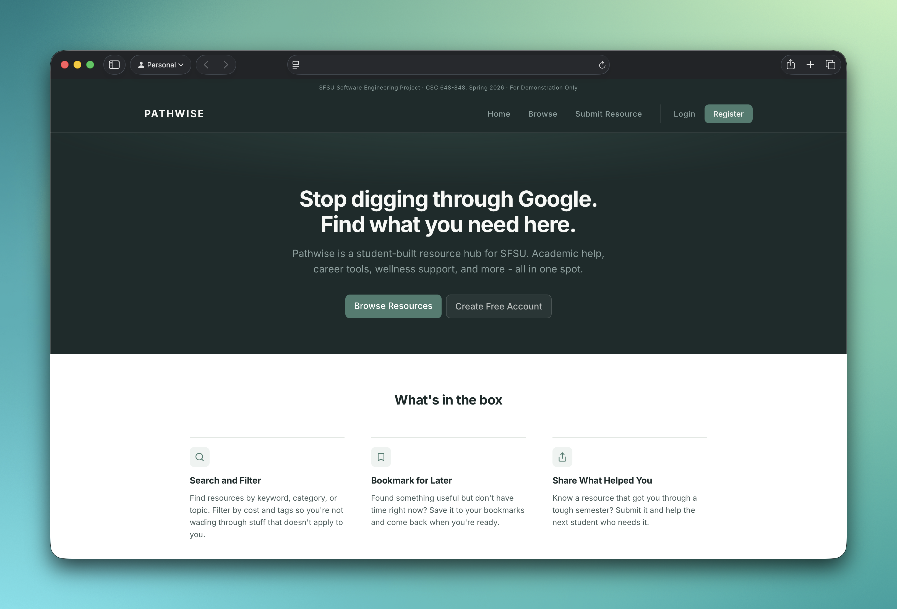
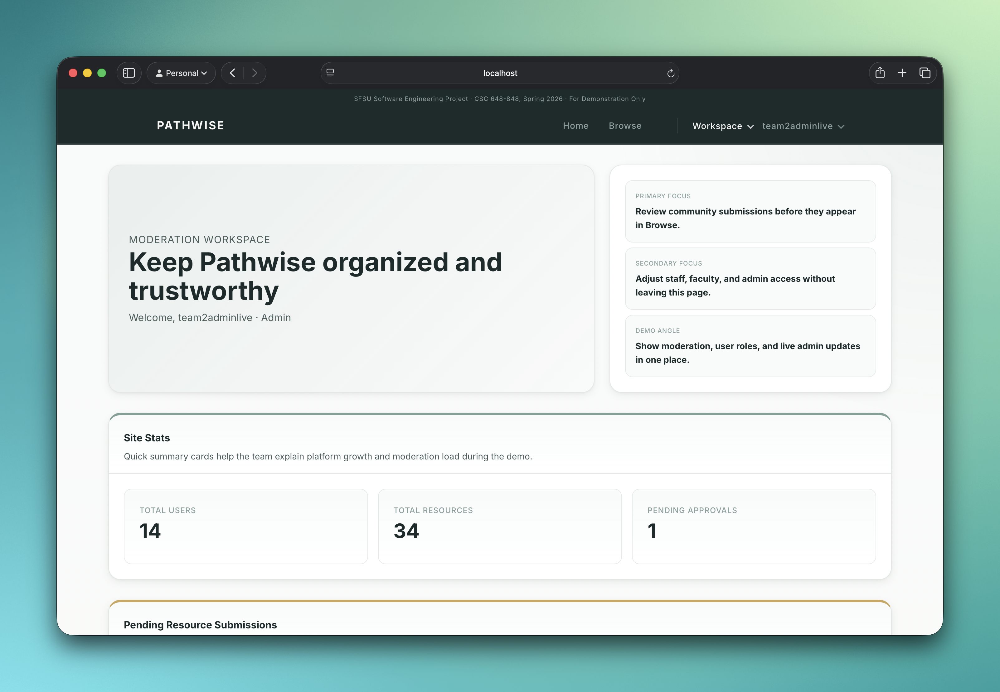
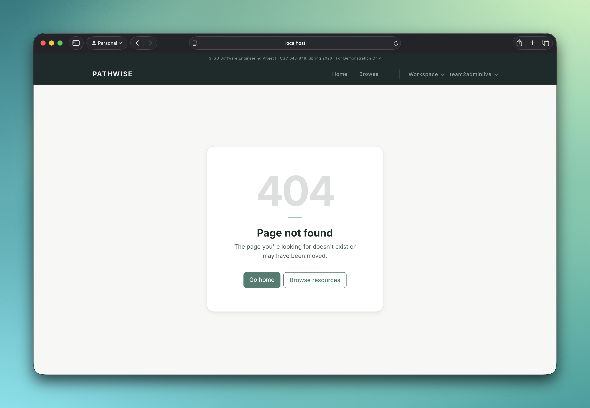

# Pathwise

Pathwise is an AI-assisted student success platform for turning academic and career goals into structured plans, milestones, and resource recommendations.

Built as an SFSU CSC 648/848 team project, this public repo is my cleaned portfolio version: core product code, no course PDFs, no credentials, no assignment clutter.

**My role:** full-stack engineer, frontend/platform focus  
**Stack:** Node.js, Express, MySQL, vanilla JavaScript, HTML/CSS, Jest, Supertest  
**Focus areas:** product UI, routing, authenticated flows, admin moderation, resource discovery, responsive polish, AI goal planning integration

## Product Experience

The landing flow frames Pathwise as a practical resource hub for students: fast browse entry, clear account actions, and a calm visual system built for an academic support product.



## What I Built

- Built and polished the vertical prototype across landing, browse, auth, dashboard, goals, templates, bookmarks, profile, admin, and error states.
- Wired frontend pages into Express APIs for search, bookmarks, profiles, dashboards, goals, recommendations, templates, and admin workflows.
- Implemented role-aware navigation and protected route behavior for guest, student, and admin experiences.
- Helped integrate AI-assisted goal planning with token limits, draft validation, editable generated plans, and save flows.
- Added recommendation surfaces using goal/project/resource signals with fallbacks when user history is thin.
- Stabilized routing, 404 behavior, mobile layouts, empty states, and final demo polish.

## Admin And Trust

Pathwise includes an admin workspace for reviewing community submissions, tracking site stats, and managing user access. This matters because student-facing AI/resource products need moderation and trust controls, not just a nicer search box.



## Engineering Signals

- **Backend structure:** route modules grouped by product area under `application/routes/`.
- **Database design:** incremental MySQL migrations plus `masterMigration.sql` for fresh setup.
- **Auth model:** Express sessions, bcrypt password hashing, and role middleware.
- **AI integration:** Gemini-backed goal-plan drafts with sanitization before persistence.
- **Testing:** Jest/Supertest smoke coverage for public search and protected endpoints.
- **Deployment awareness:** Nginx proxy config and EC2/RDS-oriented setup notes.

## Product Polish

Small details were treated as product work, including branded error handling and navigation recovery paths.



## Repo Map

- `application/server.js` - Express entry point and route mounting.
- `application/routes/` - auth, resources, goals, admin, recommendations, reports, and related APIs.
- `application/services/` - AI plan generation, activity logging, and recommendation preview logic.
- `application/vertical-prototype/` - frontend pages, CSS, and client-side JavaScript.
- `application/db/migrations/` - MySQL schema evolution and bootstrap scripts.
- `application/tests/` - API smoke tests.
- `config/` - deployment support.
- `docs/screenshots/` - portfolio screenshots.

## Run Locally

```bash
npm install --prefix application
cp application/.env.example application/.env
npm start
```

The app runs at `http://localhost:3000`.

Run tests:

```bash
npm --prefix application test
```

Fresh database bootstrap:

```bash
mysql -h "$DB_HOST" -P "$DB_PORT" -u "$DB_USER" -p "$DB_NAME" < application/db/migrations/masterMigration.sql
mysql -h "$DB_HOST" -P "$DB_PORT" -u "$DB_USER" -p "$DB_NAME" < application/db/migrations/003_m3_seed_demo.sql
```

## Attribution

Pathwise was developed by Team 02 for SFSU CSC 648/848 Spring 2026. This repo highlights my contributions and engineering judgment while preserving the original team context.
